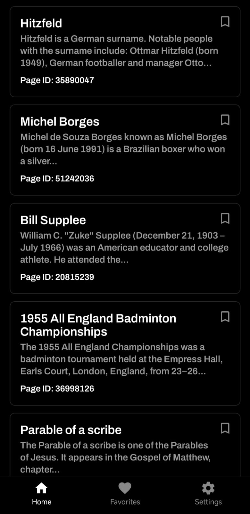
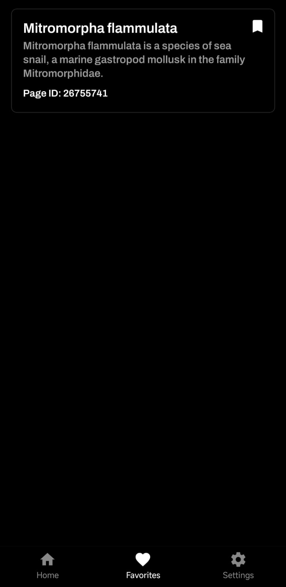
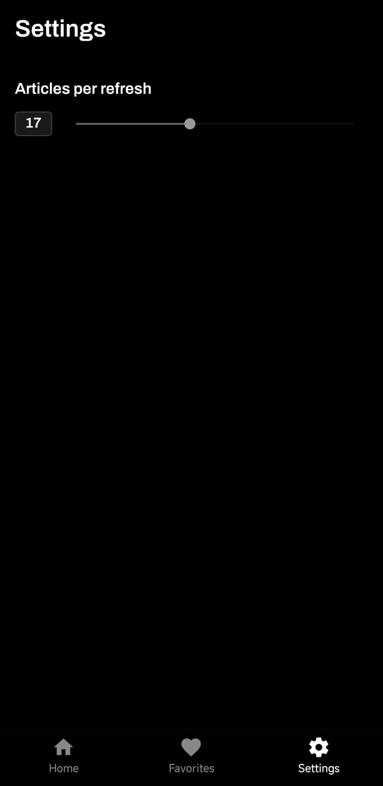

<div align="center">
  
  
  # Wiki Random
  
  **Random Wikipedia articles • Save favorites • Endless discovery**
  
  *Your gateway to serendipitous learning. Pull down to refresh and discover a curated selection of random Wikipedia articles tailored to your reading preferences.*
  
  [](https://github.com/mulitet4/Wiki-Random/releases/download/latest/wiki-random_v1.0.0.apk)
</div>

---

## Screenshots

<div align="center">
  
  
  
</div>

---

## Features

- **Random Wikipedia Articles** - Pull to refresh for new discoveries
- **Save Favorites** - Bookmark articles for later reading
- **Customizable Limit** - Adjust how many articles load per refresh (1-40)
- **Dark Theme** - Easy on the eyes, modern design
- **Smooth UX** - Optimized for mobile with responsive gestures

---

## Built With

- **React Native 0.81.5** - Cross-platform mobile development
- **Expo SDK 54** - Streamlined development and deployment
- **Expo Router** - File-based routing
- **NativeWind** - Tailwind CSS for React Native
- **AsyncStorage** - Local data persistence
- **Wikipedia API** - Real-time article data

---

## Getting Started

### Prerequisites

- Node.js (v16+)
- Expo CLI (`npm install -g expo-cli`)
- iOS/Android emulator or physical device

### Installation

```bash
git clone https://github.com/mulitet4/Wiki-Random.git
cd Wiki-Random
npm install
npm run start
```

```bash
# Build APK (Android)
eas build --platform android --profile local

# Build IPA (iOS)
eas build --platform ios
```

---

## License

This project is open source and available under the MIT License.

---

## Contributing

Contributions are welcome! Feel free to fork the repository and submit pull requests.

---

<div align="center">
  
</div>
